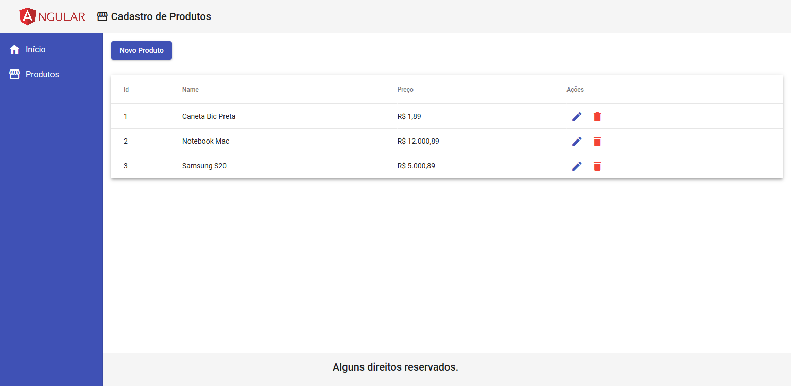

# Angular CRUD

## Descrição

Pequeno projeto feito durante os meus estudos de Angular. Neste site é possível realizar um CRUD de produto.

## Tecnologia Utilizada

O front-end foi implementado usando o framework [Angular](https://angular.io/).

## Extensões e Bibliotecas Utilizadas

Para construção de interfaces foi utlizado o [Angular Material](https://material.angular.io/).

Para simular um back-end foi utilizado o [typicode/json-server](https://github.com/typicode/json-server).

